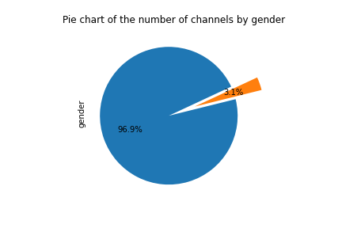

# Top Programming Guru: Project Overview

In this project will collocate data of set of    YouTube channels that  were nominated in Top Programming Guru. These YouTube channels  helped  people to advance their careers in programming. The ranking of this youtube channels  is based on the vote of the community.

* Scraped over 30000 videos statistics data from youtube using python and YouTube API,
* Look for trending programming skills  from the title of each video.

___

 

## Code and Resources Used 
**Python Version:** 3.7  
**Packages:** pandas, numpy, sklearn, matplotlib, seaborn, selenium, flask, json, pickle  

**[Python YouTube API Tutorial: Getting Started - Creating an API Key and Querying the API](https://www.youtube.com/watch?v=th5_9woFJmk&t=461s)
**[Using Python and YouTube API to Create Analytics on any Channel.
](https://www.youtube.com/watch?v=2mSwcRb3KjQ)

## Web Scraping
We scraped the page (Top Programming Guru)[https://noonies.tech/award/top-programming-guru]  to get the nominated channels. For each channel, we got the following:

* channel name
* url
* rank

## YouTube API

* channel name 
* channel title
* channel Id
* description
* rank
* country
* view count
* subscriber Count
* video count
* published At
* uploads

We used YouTube api to scrape 30000 videos data. With each video, we got the following:

* video Id
* title
* tags
* view count
* like count
* dislike count
* comment count
* description (to do)
* duration 
* channel id
* default Audio Language
* published At 

## Data Cleaning
After scraping the data, I needed to clean it up so that it was usable for our model. I made the following changes and created the following variables:

* Parsed numeric data out of salary 
* Removed duplicates channels
* Removed outliers 
* Parsed rating out of company text 
* Made a new columns for  location
* Made a new columns to masure interaction with videos 
* Added a gender column for each youtube channel 
* Use to data of the first vidoe published in channel to estimate it's age. 

## EDA
We looked at the distributions of the data and the value counts for the various categorical variables. Below are a few highlights from the pivot tables. 

