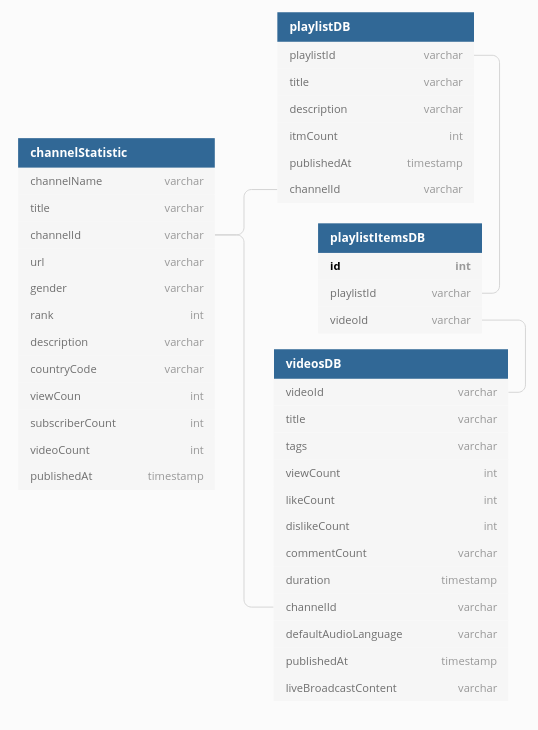

# Top Programming Guru: Project Overview

In this project, we collected data from YouTube channels that were named in [Top Programming Guru](https://noonies.tech/award/top-programming-guru). 
These YouTube channels  helped  people to advance their careers in programming. 
The ranking of this YouTube channels  is based on the vote of the community. 

**The steps of the project:**  

* [Get the Top Programming Guru channels](web_scraping.py)
* [How to get a YouTube channel Id?](notebook/channels_id.ipynb)
* [Extract YouTube channel statistics](notebook/channels_statistics.ipynb)
* [Extract YouTube video statistics](notebook/video_playlist.ipynb)
* [Analyzing the data set of YouTube channels](notebook/analyzing_summeryDB.ipynb)
* [Analyzing the data set of YouTube videos](notebook/analyzing_videosDB.ipynb)
* [Analyzing the data set of YouTube playlists]()(to do)
* [Create database from csv file]()(to do)

## Code and Resources Used 
**Python Version:** 3.7  
**Packages:** pandas, numpy, sklearn, matplotlib, seaborn, selenium  
**[Python YouTube API Tutorial: Getting Started - Creating an API Key and Querying the API](https://www.youtube.com/watch?v=th5_9woFJmk&t=461s)**  
**[Using Python and YouTube API to Create Analytics on any Channel.
](https://www.youtube.com/watch?v=2mSwcRb3KjQ)**

## Web Scraping
We scraped the page [Top Programming Guru](https://noonies.tech/award/top-programming-guru)  to get the nominated channels. 
For each channel, we got the following:

* channel name
* url
* rank

## YouTube API
We used the YouTube API to collect the following data for each Top Programming Guru channel:
* channel name 
* channel title
* channel Id
* description
* rank
* country
* view count
* subscriber Count
* video count
* published At
* uploads

Then, we used the YouTube api to extract statistical 
data for each video and playlist in each channel.   
For each video, we got the following:

* video Id
* title
* tags
* view count
* like count
* dislike count
* comment count
* description (to do)
* duration 
* channel id
* default Audio Language
* published At 

For playlist, we got the following:
* playlist Id
* title
* description
* itm count
* publishe at
* channel id  

Finally, we retrieved for each playlist its items using the playlist Id.
* video Id
* playlist Id

## Data Cleaning
After collecting  the data, We needed to clean it up so that it was usable for our model 
and visualization . 
we made the following changes and created the following variables:
 
* Removed duplicates channels
* Removed outliers  
* Made a new columns for  location
* Made a new columns to measure interaction with videos 
* Added a gender column for each YouTube channel 
* Used data from the first video uploaded to a channel to estimate its age. (to do)

## EDA
We looked at the distributions of the data, and the value counts for the various categorical variables. Below are a few highlights from the pivot tables. 

## Database Schema

